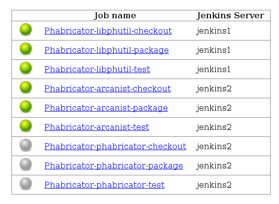

# Howto

1. Clone the jjb-phabricator

```
git clone git@github.com:roidelapluie/jjb-phabricator
```

Needed because recent versions of git do not provide a .git directory inside
submodules.

2. `vagrant up`

3. open http://192.168.50.2:8808/


